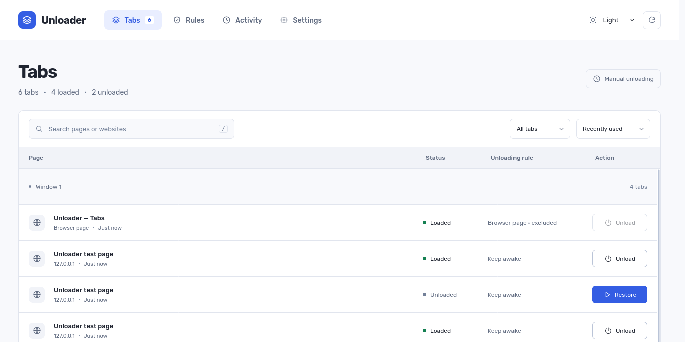
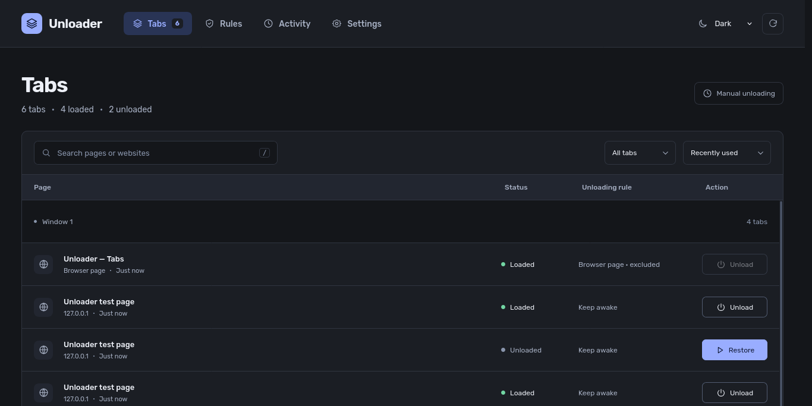

# Unloader

Keep your tabs. Let idle pages rest.

Unloader unloads idle page content while keeping the tab in your browser’s tab bar. Come back to a tab and its page reloads. It works with desktop Zen, Firefox, Chrome and Brave, and keeps your settings and browsing usage on your device.

Fresh installs start with **automatic unloading after 15 minutes**. Change the default timer, give individual websites their own rules, or unload tabs yourself from the dashboard. Existing users keep their saved settings.





*Dashboard previews use local test pages with manual unloading selected. Fresh installs enable the 15-minute automatic timer.*

## How it works

Unloader asks the browser to discard an idle tab’s page content. The tab stays in place, so you can keep your reading list, research and open projects without every page continuing to run. Selecting an unloaded tab reloads it; the dashboard also provides a **Restore** action.

Actual memory savings depend on the browser and the page. Unloading does not guarantee an immediate drop in memory usage. Reloading can lose page state that the website has not saved.

## Manage your tabs

Click the toolbar icon, then **Manage tabs** to open the dashboard.

- **Tabs:** search pages and websites, filter loaded or unloaded tabs, sort them, and view tabs grouped by browser window. Unload or restore a page directly from its row.
- **Website rules:** adjust or disable the global idle timer and choose a rule for individual websites.
- **Activity:** see the latest 100 events and clear the history when you want.
- **Settings:** export and import rules and appearance, inspect the registered shortcut, and choose System, Light or Dark mode.

The dashboard does not need to stay open for automatic unloading to work.

## Website rules

Rules match an exact hostname, such as `web.whatsapp.com`. Subdomains need separate rules. A website rule overrides the global timer.

| Rule | Behavior |
| --- | --- |
| **Keep awake** | Skip automatic unloading for this site and try to restore its discarded tabs when the browser starts. |
| **Timed** | Use a custom idle timer for this site, from 1 to 1,440 minutes. |
| **Manual** | Unload this site only when you explicitly request it. |
| **No override** | Follow the global idle timer, or manual mode if the global timer is disabled. |

For messaging pages you want ready at startup, add a **Keep awake** rule. You can still explicitly unload a Keep awake tab yourself.

## Protected pages

Automatic unloading skips active, pinned, audible, editing, media-playing and loading tabs, as well as pages without safety signals. Browser and extension pages are excluded. Private tabs are not tracked.

Editing and media checks are best effort. Use **Keep awake** for important work or sites whose state you need to preserve. Manual unloading may request confirmation for a protected page.

## Shortcuts

Use **Ctrl+Shift+U** to unload the current tab, or **Command+Shift+U** on macOS. Unloader chooses another loaded tab when unloading the active page where possible.

Browsers and operating systems can reserve shortcuts. The Settings page shows the shortcut that actually registered and directs you to the browser’s shortcut settings. The dashboard’s **Unload** button is also available.

## Zen and Firefox

Zen uses the Firefox build. Permanent installation requires a **Mozilla-signed add-on** so it stays installed after the browser restarts.

Version **0.2.0** was submitted to Mozilla with its source archive and reviewer build instructions. Publication and the signed download are pending. The reserved [Mozilla listing](https://addons.mozilla.org/en-US/firefox/addon/unloader/) may remain unavailable until publication.

[Download the Firefox development ZIP](https://github.com/wrestle-R/Unloader/releases/latest/download/unloader-firefox-unsigned.zip)

For temporary testing:

1. Download and extract the Firefox ZIP.
2. Open `about:debugging#/runtime/this-firefox` in Firefox or Zen.
3. Choose **Load Temporary Add-on** and select the extracted `manifest.json`.

**Temporary add-ons disappear after restart.** Use a signed package for everyday use. A permanently installed, enabled Unloader starts with the browser, rebuilds its background alarm and retains your saved settings.

## Chrome and Brave

[Download the Chromium ZIP](https://github.com/wrestle-R/Unloader/releases/latest/download/unloader-chromium.zip)

1. Download and extract the ZIP into a folder you will keep.
2. Open `chrome://extensions` or `brave://extensions`.
3. Enable **Developer mode**, select **Load unpacked**, and choose the extracted folder.
4. Pin Unloader’s toolbar icon for easy access.

This download uses a developer installation. It is not a Chrome Web Store package. To update an unpacked installation, replace its files with the new build and select **Reload** on the extension’s card.

[All releases and release notes](https://github.com/wrestle-R/Unloader/releases)

## Privacy

Unloader has no account system, advertising, analytics or remote data service. Settings, website rules, recent activity and focused-tab usage are stored in your local browser profile. Usage keys exclude query strings and fragments.

Page safety checks send only editing and media booleans to the local background process. Form text and values are not sent or stored by Unloader. Removing the extension removes its extension storage.

Read the [privacy policy source](next/app/privacy/page.tsx) or [extension documentation](extension/README.md) for more detail.

## Run the website

The Next.js website contains the landing page, documentation, privacy policy and GitHub Release downloads.

```bash
cd next
npm ci
npm run dev
```

For a production build, run `npm run build`. On Vercel, import this repository, select the **Next.js** preset and set **Root Directory** to **`next`**.

See [website setup](next/README.md) for configuring the published Mozilla listing and signed XPI download.

## Build the extension

Use Node.js **24.15 or newer**. Run commands from the extension folder:

```bash
cd extension
npm ci
npm run typecheck
npm test
npm run build:firefox
npm run build:chrome
```

Builds appear in `extension/.output/firefox-mv2` and `extension/.output/chrome-mv3`. Generate upload archives with `npm run zip:firefox` or `npm run zip:chrome`.

To launch a separate development browser window:

```bash
npm run preview -- --browser zen
# Also supports chrome, brave, firefox and firefox-dev.
```

See [extension development instructions](extension/README.md) for browser smoke tests and restart verification, and [Mozilla review instructions](extension/REVIEW.md) for reproducible builds.

## Repository layout

```text
Unloader/
├── next/        # Next.js website and public documentation
├── extension/   # Extension source, previews, scripts and tests
└── docs/        # Local project notes; ignored by Git
```

Each application has its own package.json and lockfile. Internal notes belong in the Git-ignored `docs/` folder; public documentation belongs in the website.

## Support

[Report a bug or request a feature](https://github.com/wrestle-R/Unloader/issues). Include your browser version and steps to reproduce. Avoid posting private tab URLs or browsing data in public issues.
